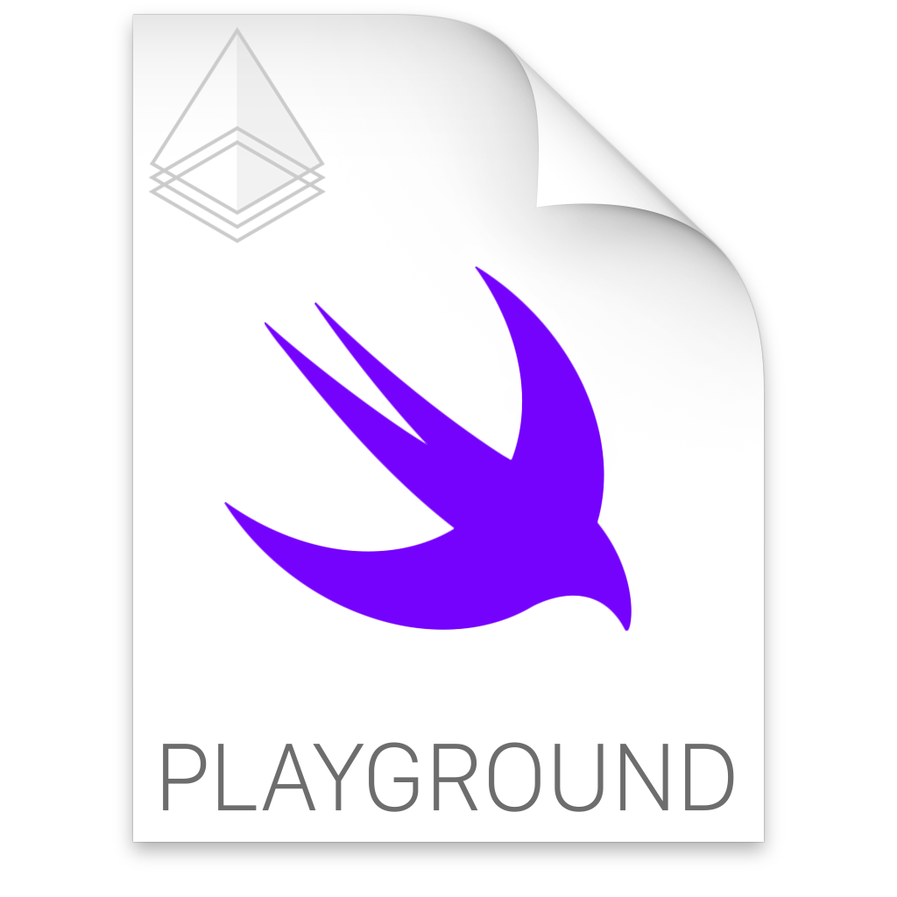

<p align="center">


<a href="https://github.com/bow-swift/nef">

</a>
<a href="https://github.com/bow-swift/nef">

</a>
<a href="https://gitter.im/bowswift/bow">

</a>
</p>

`nef`, short for [Nefertiti](https://en.wikipedia.org/wiki/Nefertiti), mother of Ankhesenamun, is a toolset to ease the **creation of documentation** in the form of Xcode Playgrounds. It provides compile-time **verification** of documentation, exports it in **Markdown** format that can be consumed by [Jekyll](https://jekyllrb.com/) to generate websites, and export [Carbon](https://carbon.now.sh/) snippets for a given Xcode Playground.

`nef` is inspired by [ΛNK](https://github.com/arrow-kt/ank) for Kotlin and [tut](https://github.com/tpolecat/tut) for Scala.

### Features

💡 Eases the creation of Xcode Playgrounds with support for [__third party libraries__](#-creating-a-nef-playground).

💡 [__Compiles Xcode Playgrounds__](#-compiling-a-nef-playground) with support for 3rd-party libraries from the command line.

💡 Builds a [__Playground Book__](#-creating-a-playground-book) for iPad with external dependencies defined in a Swift Package.

💡 Generates [__Markdown__](#-generating-a-markdown-project) project from nef Playground.

💡 Generates Markdown files that can be consumed from [__Jekyll__](#-generating-markdown-files-for-jekyll) to create a microsite.

💡 Export [__Carbon__](#-exporting-carbon-code-snippets) code snippets for a given nef Playground.

&nbsp;

## 💻 Installation

#### 📟 Using [Homebrew](https://github.com/bow-swift/homebrew-nef) (preferred)

```bash
➜ brew install nef
```

> It will warn you if there is a missing dependency and will provide guidance to install it.

&nbsp;

#### 📦 Using [Swift Package Manager](https://developer.apple.com/documentation/xcode/creating_a_swift_package_with_xcode)

`nef` can be consumed as a library in your **macOS project**.

```swift
.package(url: "https://github.com/bow-swift/nef.git", from: "{version}")
```

It is an excellent option if you want to use all nef features in your macOS app, even to build new tooling on top of nef.

> You can read more about how to use nef library in the [**nef site**](https://nef.bow-swift.io/docs/tutorials/how-to-use-nef-library-/).

&nbsp;

#### 🔌 Using [Xcode Editor Extension](https://github.com/bow-swift/nef-plugin)

Some of `nef` features can be used directly in Xcode as an Extension. You can install it directly from [**App Store**](https://apps.apple.com/app/nef/id1479391704?mt=8) or downloading the last binary from the [**releases section**](https://github.com/bow-swift/nef-plugin/releases).

&nbsp;

## Usage

### 📃 Creating a nef Playground

Xcode Playgrounds are a nice tool for prototyping and trying new concepts. However, third party libraries support is a bit cumbersome to add. One of the goals of `nef` is to make the creation of an Xcode Playground easier with support for one or more libraries.

By default, `nef` can create an Xcode Playground with support for [Bow](http://bow-swift.io), the Functional Programming companion library for Swift.

```bash
➜ nef playground
```

<p align="center">

</p>

And you can use the following option to specify the name for the `nef Playground` that you are creating:

```bash
➜ nef playground --output ~/Desktop --name LatestBowProject
```

It will create an Xcode project with support for the latest available version of Bow, named `LatestBowProject` in your `~/Desktop`. If you open this `nef playground`, you will find an Xcode Playground where you can import Bow or any of its modules, and start trying some of its features.

By default, `nef playground` will be created for iOS platform. If you need to change it, you can use the `--platform` option.

```bash
➜ nef playground --platform osx
```

If you need to take advantage of nef in your Xcode Playgrounds, you can transform your Xcode Playground into a nef Playground using the following command:

```bash
➜ nef playground --playground <Xcode Playground>
```

Where `<Xcode Playground>` is the path to your Xcode Playground.

###

<details>
<summary>📣 You can create a nef Playground compatible with any different Bow version, branch or commit; even third-party dependencies</summary>

###

> Note: The next three options are mutually exclusive.

###

- `--bow-version <x.y.z>`: Specify the version of Bow that you want to use in the project. This option lets you test an old version of the library in an Xcode Playground. Example:

```bash
➜ nef playground --name OldBowProject --bow-version 0.3.0
```

##

- `--bow-branch <branch name>`: Specify the branch of Bow that you want to use in the project. This option lets you test features of Bow that are still in development in a branch that has not been merged or released yet. Example:

```bash
➜ nef playground --name BranchBowProject --bow-branch master
```

##

- `--bow-commit <commit hash>`: Specify the commit hash of Bow that you want to use in the project. This option lets you test features of Bow exactly at the moment you need, released or not. Example:

```bash
➜ nef playground --name CommitBowProject --bow-commit e70c739067be1f5700f8b692523e1bb8931c7236
```

##

- `--podfile <podfile>`: Specify a **Podfile** with your own dependencies. This option lets you create a Playground with support for other libraries. Create a `Podfile` listing your dependencies and pass it to `nef`. Example:

Your `Podfile`, located in `./folder/dependencies`:

```ruby
target 'MyPodsProject' do
  platform :osx, '10.14'
  use_frameworks!

  pod 'Bow', '~> 0.3.0'
end
```

```bash
➜ nef playground --name MyPodsProject --podfile ./folder/dependencies/Podfile
```

##

- `--cartfile <cartfile>`: Specify a **Cartfile** with your dependencies. Create a `Cartfile` listing your dependencies and pass it to `nef`. Example:

Your `Cartfile`, located in `./folder/dependencies`:

```ruby
github "bow-swift/Bow"
```

```bash
➜ nef playground --name MyCarthageProject --cartfile ./folder/dependencies/Cartfile
```

</details>

&nbsp;

### 🔨 Compiling a nef Playground

Xcode lets you check for correctness of your Xcode Playground and run it. However, Apple does not provide us commands to compile an Xcode Playground, as they do for building Xcode projects. It is particularly useful in Continuous Integration when you want to verify that your playgrounds are not broken when the libraries you depend on are updated. `nef` has an option to compile a `nef Playground`. To do this, you can run the following command:

```bash
➜ nef compile --project <nef playground>
```
> If you need to transform your Xcode Playground into a nef Playground you can check [Creating a nef Playground](#-creating-a-nef-playground) section.

Where `<nef playground>` is the path to `nef Playground` where your playgrounds are located. Also, you can use the following option with this command:

- `--use-cache`: Use cached dependencies if it is possible, in another case, it will download them. Example:

```bash
➜ nef compile --project <nef playground> --use-cache
```

You can also clean the result of the compilation:

```bash
➜ nef clean --project <nef playground>
```

&nbsp;

### 📲 Creating a Playground Book

Swift Playgrounds is a revolutionary app that makes possible to write Swift code on an iPad. In the latest updates, Swift Playgrounds 3.x has added a new feature: [UserModules](https://developer.apple.com/documentation/swift_playgrounds/structuring_content_for_swift_playgrounds/using_modules_to_share_code_in_a_playground_book); it lets you include swift code and make it available across multiple chapters like modules.

nef takes advantage of these new possibilities and advancements in Swift Package Manager to build a Playground Book with external dependencies from a Swift Package specification.

Given a `Package.swift` like the next one:
```swift
// swift-tools-version:5.0

import PackageDescription

let package = Package(
    name: "BowProject",
    dependencies: [
        .package(url: "https://github.com/bow-swift/bow.git", from: "0.7.0"),
    ]
)
```

you can run the following command:

```bash
➜ nef ipad --name PlaygroundName --package Package.swift --output ~/Desktop
```

It will create a Playground Book (`PlaygroundName`) with support for the external dependencies and save it in `~/Desktop`

Options:
- `--name`: the name for the Playground Book to build.
- `--package`: path to the Swift Package specification.
- `--output`: path where the resulting Playground Book will be generated.

&nbsp;

### 🔖 Generating a Markdown project

Xcode Playgrounds let you write comments in Markdown format using the symbols `//:` for single line comments, or `/*: */` for multiline comments. Inside these comments, you can use any Markdown syntax; an example:

```swift
/*:
 # This is a heading 1

 This is regular text. *This is bold text*. [This is a link](http://bow-swift.io).
 */
protocol MyProtocol {}

//: ## This is a single line heading 2
```

It makes Xcode Playgrounds the proper tool to write an article with compilable examples. The command provided by `nef` to generate the Markdown files is:

```bash
➜ nef markdown --project <nef playground> --output <path>
```

Options:

- `--project`: Path to your nef Playground.
- `--output`: Path where the resulting Markdown project will be generated.

&nbsp;

### 🌐 Generating Markdown files for Jekyll

As you can write comments in [Markdown](https://developer.apple.com/library/archive/documentation/Xcode/Reference/xcode_markup_formatting_ref/index.html) in Xcode Playgrounds, this makes it very suitable to write documentation with compilable examples.
Leveraging this, `nef` can create Markdown files that can be consumed from Jekyll to generate a microsite. The command to do this is:

```bash
➜ nef jekyll --project <nef playground> --output <path> --main-page <main-page>
```

Options:

- `--project`: Path to your nef Playground.
- `--output`: Path where the resulting Markdown files will be generated.
- `--main-page`: Optional. Path to 'README.md' file to be used as the index page of the generated microsite.

###

<details>
<summary>📣 How to setup a nef Playgroud for Jekyll?</summary>

###

`nef` finds all the Xcode Playgrounds in a nef Playground. Each playground is considered a section in the generated microsite structure. For each page in a playground, an entry in the corresponding section is created. The page is transformed from Swift to Markdown using the syntax described above. As a result, a directory structure matching the nef Playground structure is generated, together with a `sidebar.yml` that can be used as a menu in Jekyll.

`nef` adds some commands to modify the Markdown transformation process. All `nef` commands are included as Swift comments. They begin with `// nef:begin:` and end with `// nef:end`. The supported commands are:

- `header`: It lets you add metadata to a playground page to be consumed by Jekyll. You must provide the layout that this page will use in Jekyll. The remaining attributes are optional, and you may include any of them according to your Jekyll configuration. `nef` will take care of the permalinks as well. Example (at the beginning of the playground page):

```swift
// nef:begin:header
/*
  layout: docs
*/
// nef:end
```

- `hidden`: It lets you hide a portion of your playground in the output Markdown file. It is useful to hide imports or supporting utility code to make an example work. Example:

```swift
// nef:begin:hidden
import Bow // This will be hidden in the Markdown file
// nef:end

struct Person {} // This will be present in the Markdown file
```
</details>

&nbsp;

### 🌁 Exporting Carbon code snippets

Xcode Playgrounds are a great place for prototyping and trying new concepts. Oftentimes we want to share some Swift snippets. `Carbon` is a cool tool for this, and `nef` nicely integrates with it. You can take your nef Playground, write several pieces of code, and keep it verified. Later, you can export all your code snippets with the next command:

```bash
➜ nef carbon --project <nef playground> --output <path>
```

Options:

- `--project`: Path to your nef Playground.
- `--output`: Path where the resulting Carbon snippets will be generated.

###

<details>
<summary>📣 You can customize the output with the next commands</summary>

###
<table>
  <tr>
    <th width="20%">Command</th>
    <th width="20%">Description</th>
    <th width="18%">Format</th>
    <th>Options</th>
    <th width="5%">Default</th>
  </tr>
  <tr>
    <td align="center"><code>--background</code></td>
    <td>Background color applied to image</td>
    <td>hexadecimal <code>#AABBCC</code>, <code>#AABBCCDD</code> or predefined colors</td>
    <td> <code>nef</code>  <code>bow</code>  <code>white</code> <br \> <code>green</code> <code>blue</code> <code>yellow</code> <br \> <code>orange</code</td>
    <td align="center"><code>nef</code></td>
  </tr>
  <tr>
    <td align="center"><code>--theme</code></td>
    <td>Carbon's theme to be applied</td>
    <td align="center">String</td>
    <td><code>base16-dark</code> <code>blackboard</code> <code>cobalt</code> <code>duotone-dark</code> <code>dracula</code> <code>hopscotch</code> <code>lucario</code> <code>material</code> <code>monokai</code> <code>night-owl</code> <code>nord</code> <code>oceanic-next</code> <code>one-dark</code> <code>panda-syntax</code> <code>paraiso-dark</code> <code>seti</code> <code>shades-of-purple</code> <code>synthwave-84</code> <code>tomorrow-night-bright</code> <code>twilight</code> <code>verminal</code> <code>vscode</code> <code>zenburn</code></td>
    <td align="center"><code>dracula</code></td>
  </tr>
  <tr>
    <td align="center"><code>--size</code></td>
    <td>Export file dimensions</td>
    <td align="center">Number</td>
    <td align="center">[<code>1</code>, <code>5</code>]</td>
    <td align="center"><code>2</code></td>
  </tr>
  <tr>
    <td align="center"><code>--font</code></td>
    <td>Font type</td>
    <td align="center">String</td>
    <td><code>fira-code</code> <code>hack</code> <code>inconsolata</code> <code>iosevka</code> <code>monoid</code> <code>anonymous-pro</code> <code>source-code-pro</code> <code>dm</code> <code>droid-sans-mono</code> <code>fantasque-sans-mono</code> <code>ibm-plex-mono</code> <code>space-mono</code> <code>ubuntu-mono</code></td>
    <td align="center"><code>firaCode</code></td>
  </tr>
  <tr>
    <td align="center"><code>--lines</code></td>
    <td>shows/hides number of lines in code snippet</td>
    <td align="center">Bool</td>
    <td><code>true</code> <code>false</code></td>
    <td align="center"><code>true</code></td>
  </tr>
  <tr>
    <td align="center"><code>--watermark</code></td>
    <td>shows/hides watermark in code snippet</td>
    <td align="center">Bool</td>
    <td><code>true</code> <code>false</code></td>
    <td align="center"><code>true</code></td>
  </tr>
</table>

#### Example of use

If we have a project created by `nef`, and an Xcode playground with the next content:
```swift
let example = "This is an example"
print("nef is super cool: \(example)")

// nef is super cool: This is an example
```

Running the following command, we will customize the `background color` to  bow, `hide the number of lines`, and set the export file to `size 3`:

```bash
➜ nef carbon --project . --output ~/Desktop/nef-carbon --background bow --size 3 --show-lines false
```

<p align="center">

</p>

</details>

&nbsp;

## ❤️ Contributing to the project

You can contribute in different ways to make `nef` better:

- File an issue if you encounter a bug or malfunction in `nef`.
- Suggest a new use case or feature for `nef`.
- Open a Pull Request fixing a problem or adding new functionality. You can check the [Issues](https://github.com/bow-swift/nef/issues) to see some of the pending tasks.
- Discuss with us in the [Gitter channel for Bow](https://gitter.im/bowswift/bow) about all the above.

### How to run the project

Open `project/nef.xcodeproj` in Xcode 11 (or newer) and you are ready to go. nef uses the [Swift Package Manager] to handle its dependencies - they will be resolving automatically from Xcode.

### How to run the documentation project

- Go to main directory where you can find the nef Playground `Documentation`.
- Run `nef compile --project Documentation.app` to get all dependencies.
- Open `Documentation` and run the project.

For further information, refer to our [Contribution guidelines](CONTRIBUTING.md).

&nbsp;

# ⚖️ License

    Copyright (C) 2019 The nef Authors

    Licensed under the Apache License, Version 2.0 (the "License");
    you may not use this file except in compliance with the License.
    You may obtain a copy of the License at

       http://www.apache.org/licenses/LICENSE-2.0

    Unless required by applicable law or agreed to in writing, software
    distributed under the License is distributed on an "AS IS" BASIS,
    WITHOUT WARRANTIES OR CONDITIONS OF ANY KIND, either express or implied.
    See the License for the specific language governing permissions and
    limitations under the License.
