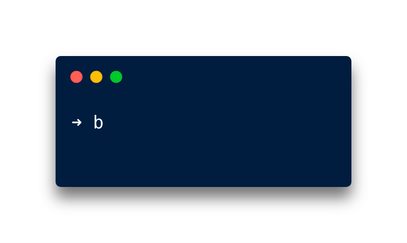
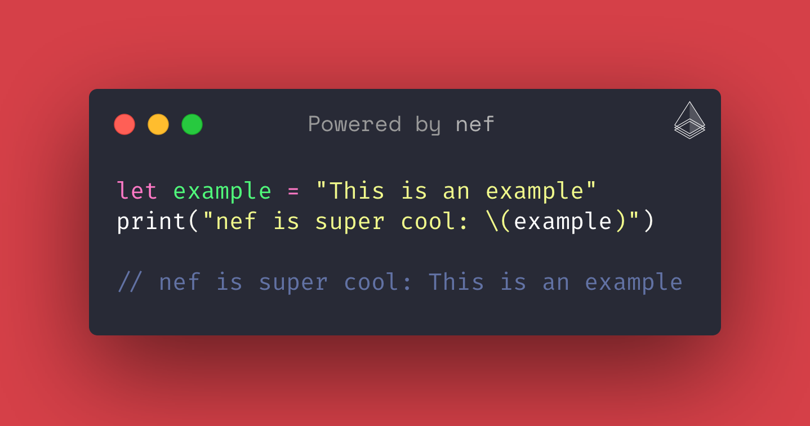

<p align="center">
<a href="https://travis-ci.org/bow-swift/nef">

</a>
<a href="https://github.com/bow-swift/nef">

</a>
<a href="https://gitter.im/bowswift/bow">

</a>

</p>

`nef`, short for [Nefertiti](https://en.wikipedia.org/wiki/Nefertiti), mother of Ankhesenamun, is a command line tool to ease the creation of documentation in the form of Xcode Playgrounds. It provides compile-time verification of documentation and exports it in Markdown format that can be consumed by [Jekyll](https://jekyllrb.com/) to generate websites.

`nef` is inspired by [ΛNK](https://github.com/arrow-kt/ank) for Kotlin and [tut](https://github.com/tpolecat/tut) for Scala.

## 📥 Installation

`nef` can be installed using [Homebrew](https://brew.sh). `nef` needs Xcode and [Cocoapods](https://cocoapods.org) as dependencies. It will warn you if there is a missing dependency and will provide guidance to install it.

<p align="center">

</p>

## 🌟 Features

`nef` highlights the following features:

💡 Eases the creation of Xcode Playgrounds with support for [__third party libraries__](#-creating-a-xcode-playground).

💡 [__Compiles Xcode Playgrounds__](#-compiling-a-xcode-playground) with support for third party libraries from the command line.

💡 Generates [__Markdown__](#-generating-a-markdown-project) project from Xcode Playground.

💡 Generates Markdown files that can be consumed from [__Jekyll__](#-generating-markdown-files-for-jekyll) to create a microsite.

💡 Export [__Carbon__](#-exporting-carbon-code-snippets) code snippets for given Xcode Playgrounds.

&nbsp;

### 📃 Creating a Xcode Playground

Xcode Playgrounds are a nice tool for prototyping and trying new concepts. However, third party libraries support is a bit cumbersome to add. One of the goals of `nef` is to make easier the creation of a Xcode Playground with support for one or more libraries.

By default, `nef` can create a Xcode Playground with support for [Bow](http://bow-swift.io), the Functional Programming companion library for Swift.

```bash
➜ nef playground
```

And you can use the following option to specify the name for the Xcode project that you are creating.

```bash
➜ nef playground --name LatestBowProject
```

It will create an Xcode project with support for the latest available version of Bow, named `BowPlayground`. If you open this Xcode project, you will have a Xcode Playground where you can import Bow or any of its modules, and start trying some of its features.

###

<details>
<summary>You can select any different Bow version or branch, even a third-party dependency</summary>

###

> Note: The next three options are mutually exclusive.

###

- `--bow-version <x.y.z>`: Specify the version of Bow that you want to use in the project. This option lets you test an old version of the library in a Xcode Playground. Example:

```bash
➜ nef playground --name OldBowProject --bow-version 0.3.0
```

##

- `--bow-branch <branch-name>`: Specify the branch of Bow that you want to use in the project. This option lets you test features of Bow that are still in development in a branch that has not been merged or released yet. Example:

```bash
➜ nef playground --name BranchBowProject --bow-branch master
```

##

- `--podfile <Podfile>`: Specify a Podfile with your own dependencies. This option lets you create a Playground with support for other libraries. Create a `Podfile` listing your dependencies and pass it to `nef`. Example:

Your `Podfile`, located in `./folder/dependencies`:

```ruby
target 'MyPodsProject' do
  platform :osx, '10.14'
  use_frameworks!

  pod 'Bow', '~> 0.3.0'
end
```

```bash
➜ nef playground --name MyPodsProject --podfile ./folder/dependencies/Podfile
```

</details>

&nbsp;

### 🔨 Compiling a Xcode Playground

Xcode lets you check for correctness of your Xcode Playground and run it. However, compiling a Xcode Playground from the command line is not so easy when it has dependencies on third party libraries. This is particularly useful in Continuous Integration, when you want to verify that your playgrounds are not broken when the libraries you depend on are updated. `nef` has an option to compile Xcode Playgrounds in an Xcode project with dependencies. To do this, you can run the following command:

```bash
➜ nef compile <path>
```

Where `<path>` is the path to the folder where the project and playgrounds are located. You can use the following option with this command:

- `--use-cache`: Use cached dependencies if it is possible, in another case, it will download them. Example:

```bash
➜ nef compile <path> --use-cache
```

You can also clean the result of the compilation:

```bash
➜ nef clean <path>
```

&nbsp;

### 🔖 Generating a Markdown project

Xcode Playgrounds let you write comments in Markdown format using the symbols `//:` for single line comments, or `/*: */` for multiline comments. Inside this comments, you can use any Markdown syntax; an example:

```swift
/*:
 # This is a heading 1

 This is regular text. *This is bold text*. [This is a link](http://bow-swift.io).
 */
protocol MyProtocol {}

//: ## This is a single line heading 2
```

It makes Xcode Playgrounds the proper tool to write an article with compilable examples. The command provided by `nef` to generate the Markdown files is:

```bash
➜ nef markdown --project <path-to-input> --output <path-to-output>
```

Options:

- `--project`: Path to the folder containing the Xcode project with Xcode Playgrounds.
- `--output`: Path where the resulting Markdown project will be generated.

&nbsp;

### 🖥 Generating Markdown files for Jekyll

As you can write comments in [Markdown](https://developer.apple.com/library/archive/documentation/Xcode/Reference/xcode_markup_formatting_ref/index.html) in Xcode Playgrounds, this makes very suitable to write documentation with compilable examples.
Leveraging this, `nef` can create Markdown files that can be consumed from Jekyll to generate a microsite. The command to do this is:

```bash
➜ nef jekyll --project <path-to-input> --output <path-to-output> --main-page <path-to-index>
```

Options:

- `--project`: Path to the folder containing the Xcode project with Xcode Playgrounds.
- `--output`: Path where the resulting Markdown files will be generated.
- `--main-page`: Optional. Path to a `README.md` file to be used as the index page of the generated microsite.

###

<details>
<summary>How to setup a Xcode Playgroud for Jekyll?</summary>

###

`nef` finds all the Xcode Playgrounds in an Xcode project. Each playground is considered as a section in the generated microsite structure. For each page in a playground, an entry in the corresponding section is created. The page is transformed from Swift to Markdown using the syntax described above. As a result, a directory structure matching the Xcode project structure is generated, together with a `sidebar.yml` that can be used as a menu in Jekyll.

`nef` adds some commands to modify the Markdown transformation process. All `nef` commands are included as Swift comments. They begin with `// nef:begin:` and end with `// nef:end`. The supported commands are:

- `header`: It lets you add metadata to a playground page to be consumed by Jekyll. You must provide the layout that this page will use in Jekyll. The rest of attributes are optional and you may include any of them according to your Jekyll configuration. `nef` will take care of the permalinks as well. Example (at the beginning of the playground page):

```swift
// nef:begin:header
/*
  layout: docs
*/
// nef:end
```

- `hidden`: It lets you hide a portion of your playground in the output Markdown file. It is useful to hide imports or supporting utility code to make an example work. Example:

```swift
// nef:begin:hidden
import Bow // This will be hidden in the Markdown file
// nef:end

struct Person {} // This will be present in the Markdown file
```
</details>

&nbsp;

### 🌁 Exporting Carbon code snippets

Xcode Playgrounds are a great place where prototyping and trying new concepts. Many times we want to share some Swift snippets, for this `Carbon` is a cool tool and `nef` lovely integrated it. You can take your Xcode Playground, write several pieces of code and keep it on verified. Later you can export the whole code snippets, with the next command:

```bash
➜ nef carbon --project <path-to-input> --output <path-to-output>
```

Options:

- `--project`: Path to the folder containing the Xcode project with Xcode Playgrounds.
- `--output`: Path where the resulting Carbon snippets will be generated.

###

<details>
<summary>You can customize the output with the next commands</summary>

###
<table>
  <tr>
    <th width="20%">Command</th>
    <th width="20%">Description</th>
    <th width="18%">Format</th>
    <th>Options</th>
    <th width="5%">Default</th>
  </tr>
  <tr>
    <td align="center"><code>--background</code></td>
    <td>Background color applied to image</td>
    <td>hexadecimal <code>#AABBCC</code>, <code>#AABBCCDD</code> or predefined colors</td>
    <td> <code>nef</code>  <code>bow</code>  <code>white</code> <br \> <code>green</code> <code>blue</code> <code>yellow</code> <br \> <code>orange</code</td>
    <td align="center"><code>nef</code></td>
  </tr>
  <tr>
    <td align="center"><code>--theme</code></td>
    <td>Carbon's theme to be applied</td>
    <td align="center">String</td>
    <td><code>cobalt</code> <code>blackboard</code> <code>dracula</code> <code>duotone</code> <code>hopscotch</code> <code>lucario</code> <code>material</code> <code>monokai</code> <code>nord</code> <code>oceanicNext</code> <code>oneDark</code> <code>panda</code> <code>paraiso</code> <code>seti</code> <code>purple</code> <code>solarized </code> <code>tomorrow</code> <code>twilight</code> <code>verminal</code> <code>vscode</code> <code>zenburn</code></td>
    <td align="center"><code>dracula</code></td>
  </tr>
  <tr>
    <td align="center"><code>--size</code></td>
    <td>Export file dimensions</td>
    <td align="center">Number</td>
    <td align="center">[<code>1</code>, <code>5</code>]</td>
    <td align="center"><code>2</code></td>
  </tr>
  <tr>
    <td align="center"><code>--font</code></td>
    <td>Font type</td>
    <td align="center">String</td>
    <td><code>firaCode</code> <code>hack</code> <code>inconsolata</code> <code>iosevka</code> <code>monoid</code> <code>anonymous</code> <code>sourceCodePro</code> <code>darkMono</code> <code>droidMono</code> <code>fantasqueMono</code> <code>ibmPlexMono</code> <code>spaceMono</code> <code>ubuntuMono</code></td>
    <td align="center"><code>firaCode</code></td>
  </tr>
  <tr>
    <td align="center"><code>--lines</code></td>
    <td>shows/hides number of lines in code snippet</td>
    <td align="center">Bool</td>
    <td><code>true</code> <code>false</code></td>
    <td align="center"><code>true</code></td>
  </tr>
  <tr>
    <td align="center"><code>--watermark</code></td>
    <td>shows/hides watermark in code snippet</td>
    <td align="center">Bool</td>
    <td><code>true</code> <code>false</code></td>
    <td align="center"><code>true</code></td>
  </tr>
</table>
  
#### Example of use

If we have a project created by `nef`, and a Xcode playground, with the next content:
```swift
let example = "This is an example"
print("nef is super cool: \(example)")

// nef is super cool: This is an example
```

running the next command we will customize the `background color` to  bow, `hides the number of lines` and set the export file to `size 3`:

```bash
➜ nef carbon --project . --output ~/Desktop/nef-carbon --background bow --size 3 --lines false
```

<p align="center">

</p>

</details>

&nbsp;

## ❤️ Contributing to the project

You can contribute in different ways to make `nef` better:

- File an issue if you encounter a bug or malfunction in `nef`.
- Suggest a new use case or feature for `nef`.
- Open a Pull Request fixing a problem or adding new functionality.
- Discuss with us in the [Gitter channel for Bow](https://gitter.im/bowswift/bow) about all the above.

&nbsp;

# ⚖️ License

    Copyright (C) 2019 The nef Authors

    Licensed under the Apache License, Version 2.0 (the "License");
    you may not use this file except in compliance with the License.
    You may obtain a copy of the License at

       http://www.apache.org/licenses/LICENSE-2.0

    Unless required by applicable law or agreed to in writing, software
    distributed under the License is distributed on an "AS IS" BASIS,
    WITHOUT WARRANTIES OR CONDITIONS OF ANY KIND, either express or implied.
    See the License for the specific language governing permissions and
    limitations under the License.
